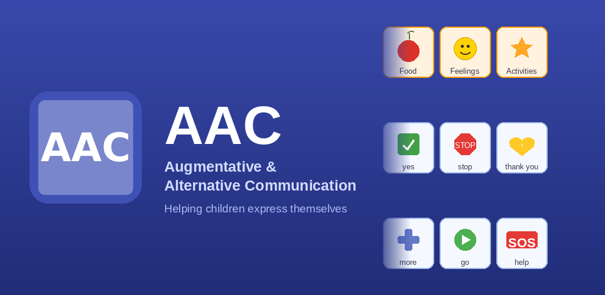
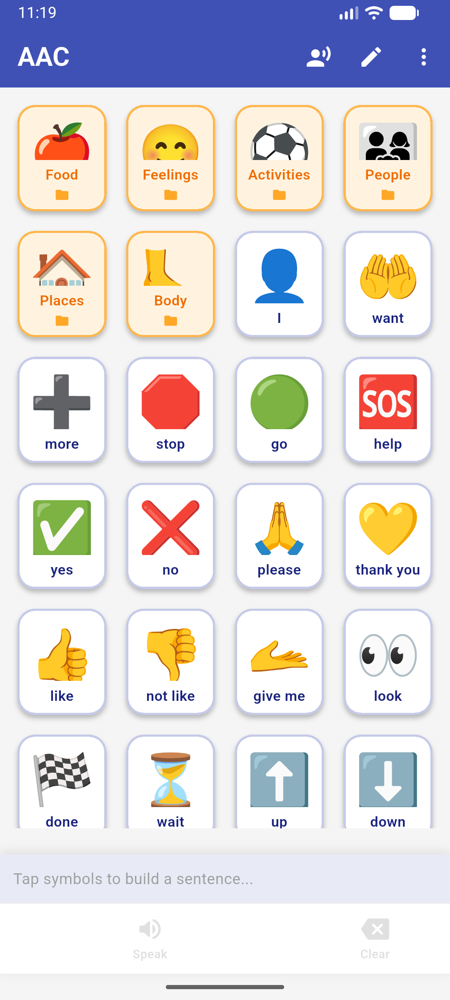
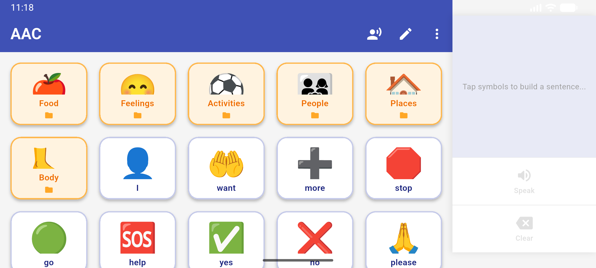

# AAC — Augmentative & Alternative Communication App

<p align="center">
  
</p>

<p align="center">
  A free, open-source Android app that helps <strong>nonverbal and minimally verbal children with autism</strong> communicate by tapping picture symbols that speak aloud.
</p>

<p align="center">
  <a href="https://github.com/tofilagman/aac/releases/latest"></a>
  <a href="https://github.com/tofilagman/aac/blob/main/LICENSE"></a>
  
  
  
</p>

---

## Screenshots

<p align="center">
  
  &nbsp;&nbsp;
  
</p>

<p align="center">
  <em>Portrait: 4-column symbol grid with sentence bar &nbsp;|&nbsp; Landscape: adaptive grid + right-side sentence panel</em>
</p>

<p align="center">
  
  &nbsp;&nbsp;
  
</p>

<p align="center">
  <em>Topic folders keep symbols organised &nbsp;|&nbsp; Math challenge protects caregiver settings</em>
</p>

---

## What is AAC?

Augmentative and Alternative Communication (AAC) gives children who cannot speak — or who have difficulty speaking — a way to express their wants, feelings, and needs. Instead of words, they tap picture symbols on a board. The app speaks the word or sentence out loud using text-to-speech.

This app is inspired by professional AAC tools like Proloquo2Go and TouchChat, built to be **simple, offline-first, and completely free** for families who need it most.

---

## Features

### For the Child
- **Symbol grid** — large, colourful, easy-to-tap picture buttons with emoji symbols
- **Folders** — symbols organised by topic (Food, Feelings, Activities, People, Places, Body)
- **Core vocabulary** — high-frequency words (I, want, more, stop, go, help, yes, no…) always visible on the home screen
- **Sentence builder** — tap multiple symbols to build a phrase shown in the bar at the bottom
- **Smart phrase expansion** — telegraphic taps are silently corrected to natural speech before the app speaks (see below)
- **Text-to-speech** — tap **Speak** and the app reads the sentence aloud
- **Voice selection** — browse and preview all voices on the device; save your preferred voice
- **Offline first** — works completely without internet, no account needed

### For Caregivers
- **Caregiver lock** — Edit and Voice settings are protected by a random math challenge so children can't accidentally change the board
- **Add symbols** — create custom symbols with any emoji and label
- **Add folders** — organise symbols into new topic folders
- **Drag to reorder** — long-press and drag any symbol or folder to rearrange
- **Delete symbols / folders** — with confirmation to prevent accidents
- **Persistent storage** — all customisations saved locally on the device

### Responsive Layout
- **Portrait** — 4-column grid, sentence bar at the bottom
- **Landscape** — column count adapts automatically (~130 px per cell), sentence panel and action buttons move to a fixed right sidebar so the full grid stays visible
- **Tablet-ready** — scales gracefully on 7-inch and 10-inch tablets in both orientations
- **Auto-hide app bar** — scrolling down hides the toolbar to maximise the symbol area

---

## Smart Phrase Expansion

Tapping symbols produces telegraphic text ("I want eat apple"). Before the app speaks, a built-in rule engine silently expands it into a natural sentence — **no internet, no AI, no external service required**.

| Tapped symbols | Spoken aloud |
|---|---|
| I · want · eat | *I want to eat* |
| I · want · eat · apple | *I want to eat an apple* |
| I · want · apple | *I want an apple* |
| I · want · go · school | *I want to go to school* |
| I · want · go · park | *I want to go to the park* |
| I · go · home | *I go home* |
| I · happy | *I feel happy* |
| I · hurt | *I feel hurt* |
| I · not like · sleep | *I do not like to sleep* |
| give me · cookie | *Give me a cookie* |
| I · want · water | *I want water* |

A small italic preview appears below the sentence chips whenever the spoken text differs from the raw taps.

---

## Symbol Library

Over **90 built-in symbols** across 6 folders:

| Folder | Sample symbols |
|--------|----------------|
| 🍎 Food | water, milk, juice, apple, banana, grapes, bread, rice, chicken, egg, cookie, candy, pizza, ice cream, cheese, noodles |
| 😊 Feelings | happy, sad, angry, scared, tired, hurt, excited, surprised, bored, love, silly, okay |
| ⚽ Activities | play, read, draw, music, outside, sleep, swim, run, jump, watch TV, paint, sing, eat, drink, bath, toilet |
| 👨‍👩‍👧 People | mom, dad, me, brother, sister, teacher, friend, doctor, grandma, grandpa |
| 🏠 Places | home, school, park, store, hospital, church, car, bathroom, bedroom, kitchen |
| 🦶 Body | head, eyes, ears, mouth, nose, hands, feet, tummy, teeth, hair |

Plus **20 core vocabulary words** always visible on the home screen:

> I · want · more · stop · go · help · yes · no · please · thank you · like · not like · give me · look · done · wait · up · down · open · close

---

## Download

Grab the latest APK from the [**Releases**](https://github.com/tofilagman/aac/releases/latest) page and install it directly on any Android device (API 21+).

---

## Building from Source

### Requirements
- Flutter 3.x
- Android SDK
- Java 21 (Temurin recommended)

### Run in development

```bash
git clone https://github.com/tofilagman/aac.git
cd aac
flutter pub get
flutter run
```

### Build a release APK

```bash
export JAVA_HOME=/usr/lib/jvm/java-21-temurin-jdk
flutter build apk --release
# → build/app/outputs/flutter-apk/app-release.apk
```

### Build a release App Bundle (Play Store)

```bash
export JAVA_HOME=/usr/lib/jvm/java-21-temurin-jdk
flutter build appbundle --release
# → build/app/outputs/bundle/release/app-release.aab
```

---

## Tech Stack

| Layer | Technology |
|-------|-----------|
| Framework | [Flutter](https://flutter.dev/) 3.x |
| State management | [Provider](https://pub.dev/packages/provider) |
| Text-to-speech | [flutter_tts](https://pub.dev/packages/flutter_tts) |
| Persistence | [shared_preferences](https://pub.dev/packages/shared_preferences) |
| IDs | [uuid](https://pub.dev/packages/uuid) |
| Phrase expansion | Custom rule engine (`lib/services/phrase_expander.dart`) |

---

## Roadmap

- [ ] Photo symbol support (camera / gallery import)
- [ ] Word prediction — suggest next symbol based on context
- [ ] Eye-gaze and switch-access scanning mode
- [ ] Multiple boards / profiles per user
- [ ] Export and share boards between devices
- [ ] More languages and localised symbol sets

---

## Privacy

This app collects **no data**. Everything stays on the device. No account, no tracking, no internet required.

See the full [Privacy Policy](https://tofilagman.github.io/aac/privacy-policy.html).

---

## Contributing

Contributions are very welcome. This app exists to help children and families — if you can improve it, please open a pull request or file an issue.

---

## License

MIT License — free to use, modify, and distribute.

---

## Acknowledgements

Built with love for children who deserve a voice. Inspired by the families, therapists, and educators who use AAC every day.
