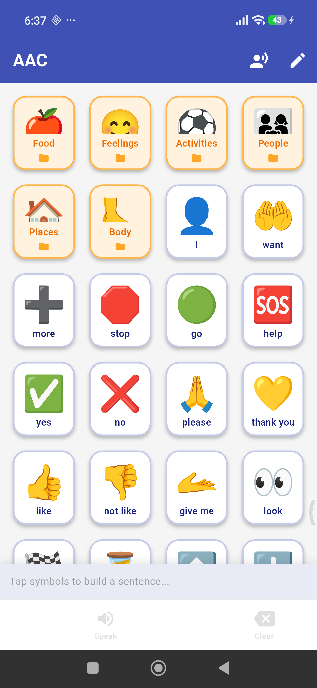

# AAC — Augmentative & Alternative Communication App

A free, open-source Android app that helps **nonverbal and minimally verbal children with autism** communicate by tapping picture symbols that speak aloud. Built with Flutter.

<p align="center">
  
</p>

---

## What is AAC?

Augmentative and Alternative Communication (AAC) gives children who cannot speak — or who have difficulty speaking — a way to express their wants, feelings, and needs. Instead of words, they tap picture symbols on a board. The app speaks the word or sentence out loud using text-to-speech.

This app is inspired by professional AAC tools like Proloquo2Go and TouchChat, built to be simple, offline-first, and free for families who need it most.

---

## Features

### For the Child
- **Symbol grid** — large, colorful, easy-to-tap picture buttons
- **Folders** — organized by topic (Food, Feelings, Activities, People, Places, Body)
- **Core vocabulary** — high-frequency words (I, want, more, stop, go, help, yes, no…) always visible on the home screen
- **Sentence builder** — tap multiple symbols to build a phrase; it appears in the bar at the bottom
- **Text-to-speech** — tap **Speak** and the app reads the sentence aloud
- **Voice selection** — browse and preview all voices available on the device; save your preferred voice
- **Offline first** — works completely without internet

### For Caregivers
- **Caregiver lock** — Edit Board and Voice settings are protected by a random math challenge (addition, subtraction, or multiplication) so children can't accidentally change the board
- **Add symbols** — create custom symbols with any emoji and label
- **Add folders** — organise symbols into new topic folders
- **Drag to reorder** — long-press and drag any symbol or folder to rearrange
- **Delete symbols/folders** — with confirmation to prevent accidents
- **Persistent storage** — all customisations are saved locally on the device

---

## Symbol Library

Over **90 built-in symbols** across 6 folders:

| Folder | Symbols |
|--------|---------|
| 🍎 Food | water, milk, juice, apple, banana, pizza, ice cream, noodles… |
| 😊 Feelings | happy, sad, angry, scared, tired, excited, bored, love… |
| ⚽ Activities | play, read, draw, music, swim, run, watch TV, bath, toilet… |
| 👨‍👩‍👧 People | mom, dad, brother, sister, teacher, friend, grandma… |
| 🏠 Places | home, school, park, store, hospital, car, bedroom… |
| 🦶 Body | head, eyes, ears, mouth, hands, feet, tummy, teeth… |

Plus **16 core vocabulary words** always on the home screen:
I · want · more · stop · go · help · yes · no · please · thank you · like · not like · give me · look · done · wait · up · down · open · close

---

## Getting Started

### Requirements
- Flutter 3.x
- Android device (API 21+)

### Build & Install

```bash
git clone https://github.com/yourusername/aac_app.git
cd aac_app
flutter pub get
flutter run
```

To build a release APK:

```bash
flutter build apk --release
```

The APK will be at `build/app/outputs/flutter-apk/app-release.apk`.

---

## Tech Stack

| Layer | Technology |
|-------|-----------|
| Framework | [Flutter](https://flutter.dev/) |
| State management | [Provider](https://pub.dev/packages/provider) |
| Text-to-speech | [flutter_tts](https://pub.dev/packages/flutter_tts) |
| Persistence | [shared_preferences](https://pub.dev/packages/shared_preferences) |
| IDs | [uuid](https://pub.dev/packages/uuid) |

---

## Roadmap

- [ ] Photo symbol support (camera / gallery import)
- [ ] Eye-gaze and switch-access scanning mode
- [ ] Multiple boards / profiles
- [ ] Export and share boards between devices
- [ ] More languages and voice options

---

## Contributing

Contributions are very welcome! This app exists to help children and families — if you can improve it, please open a pull request or file an issue.

---

## License

MIT License — free to use, modify, and distribute.

---

## Acknowledgements

Built with love for children who deserve a voice. Inspired by the families, therapists, and educators who use AAC every day.
